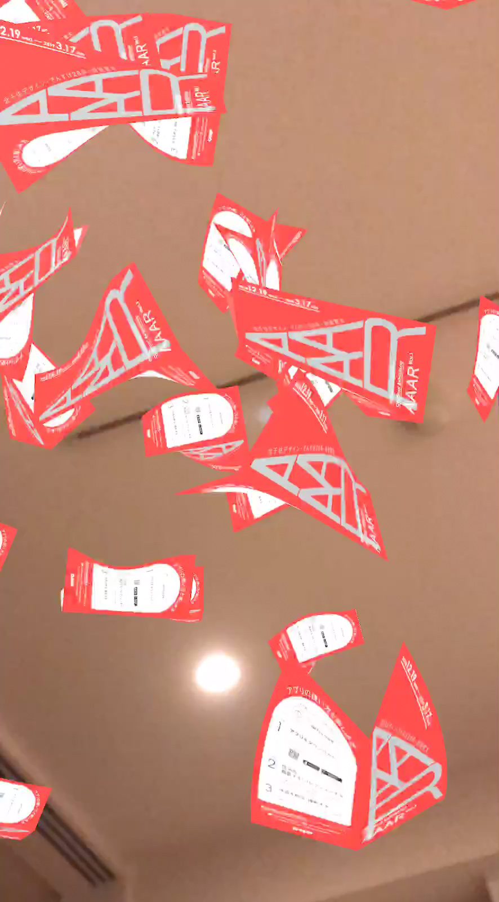
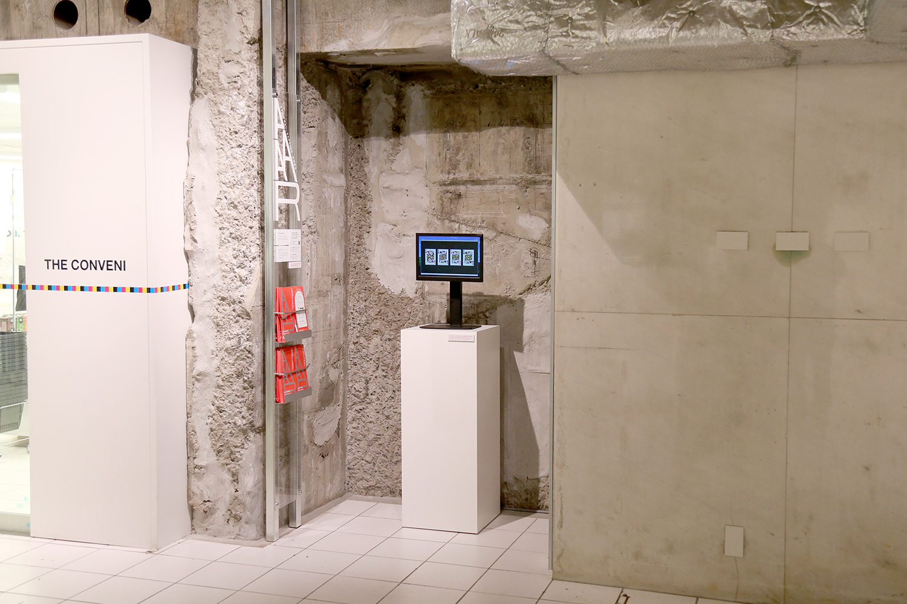

# AR_Instancing

#2018 #iOS #Unity

プログラミングにおいてクラス（≒設計図）から実体を作ることをインスタンス化と呼びますが、現実世界でインスタンス化が起きた状態（現実にはありえないですが）を仮想的に体験できる作品です。銀座ソニービルで行われたAAAR展で展示されました。

<iframe src="//player.vimeo.com/video/311863973" frameborder="0" webkitAllowFullScreen mozallowfullscreen allowFullScreen></iframe>

<iframe src="//player.vimeo.com/video/317752750" frameborder="0" webkitAllowFullScreen mozallowfullscreen allowFullScreen></iframe>

<iframe src="//player.vimeo.com/video/313741764" frameborder="0" webkitAllowFullScreen mozallowfullscreen allowFullScreen></iframe>

  &copy; <a href="https://kitasenjudesign.com">kitasenjudesign.com</a>

