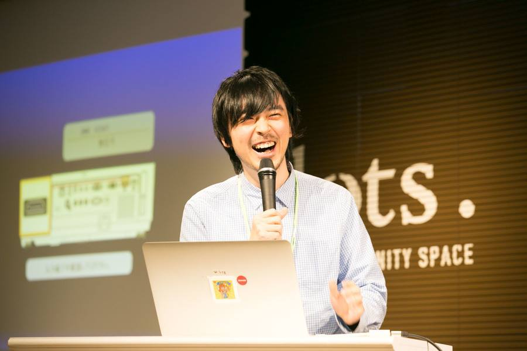

# kitasenju design profile

## text ver0

北千住デザインは、オンスクリーンにおける視覚表現の研究・開発を行っています。 主にプログラミングとリアルタイムレンダリング系のツールを用い、アルゴリズミックな表現はもちろんのこと、邪道的な道具の使い方や アイデアの組み合わせ（≒クソコラorヘタウマ）を用いて、 商業デザインの中では、こぼれ落ちてしまうような（しかし、魅力的な）視覚表現を 実験的に制作しています。そのアウトプット先として現在、 ウェブサイト・スマートフォンアプリ・VJ・ミュージックビデオ・モーションロゴ等の実績があります。

## text ver1

北千住に棲むプログラマー／アーティスト。Web、アプリ、VJなど、インタラクティブメディア上で、コードを用いて視覚表現の研究・開発をしている。21_21 DESIGN SIGHTで行われたAUDIO ARCHITECTURE展に作品を出展するなど、いろいろ活動中。
http://kitasenjudesign.com/

## text ver0

北千住デザインは、オンスクリーンにおける視覚表現の研究・開発を行っています。 主にプログラミングとリアルタイムレンダリング系のツールを用い、アルゴリズミックな表現はもちろんのこと、邪道的な道具の使い方やアイデアの組み合わせ（≒クソコラorヘタウマ）を用いて、
画一的/没個性的な表現に陥らず、新しい表現を作り出すことを目標にしています。

商業デザインの中では、こぼれ落ちてしまうような（しかし、魅力的な）視覚表現を 実験的に制作しています。そのアウトプット先として現在、 ウェブサイト・スマートフォンアプリ・VJ・ミュージックビデオ・モーションロゴ等の実績があります。

## photo

## 登壇

* 2015.12 [DemoDay.Tokyo](https://www.youtube.com/watch?v=eyGrbDR5uqk)
* 2016.10 DevFest2016 Tokyo / [資料](https://docs.google.com/presentation/d/1i9YYhNgjh1SH-xka3gpsCUG0zLz9njjzMuga3j6pobk/edit?usp=sharing)
* 2018.08 [AUDIO ARCHITECTURE展リレートーク](http://www.2121designsight.jp/program/audio_architecture/events.html)
* 2018.10 Unity x ARKit 入門Meetup
* 2019.02 [Polygon Lounge](https://github.com/PolygonLounge/PolygonLounge-1) / [資料](https://docs.google.com/presentation/d/1xxjXO9ay7tFBnDNa328HZXM5P5ifmdppKDBCVKLYSt8/edit?usp=sharing)
* 2019.05 NEORT MEETUP
* 2019.12 ARISE #2

## メディア

* 2016.03 雑誌 / [MDN 2016年3月号 人と人 「渡邊敬之 × 橋本麦」](https://books.mdn.co.jp/magazine/3215101003/)
* 2016.03 Web / [SENSORS](http://www.sensors.jp/post/demoday_3.html)
* 2018.08 Web / [HILLS LIFE](https://hillslife.jp/culture/2018/07/11/creative-process-4/)
* 2018.10 雑誌 / [ブレーン2018年10月号 今月のブックマーク寄稿](https://mag.sendenkaigi.com/brain/201810/bookmark/014298.php)
* 2019.02 ラジオ / [TOKYO SOUNDS GOOD ゲスト出演](https://twitter.com/TokyoSoundsGood/status/1101368964020486146)
* 2019.04 Web / [映像作家100選出](https://eizo100.jp/archives/category/2019/)
* 2019.08 Web / GIZMODE
* 2019.12 AppStore / App of the day

## 展示

* 2018.07 [21_21 DESIGN SIGHT / AUDIO ARCHITECTURE](http://2121designsight.jp/program/audio_architecture/)
* 2019.01 [SONY PARK / AAAR vol1](http://artscape.jp/exhibition/art-flash-news/2018/10151501_21045.html)
