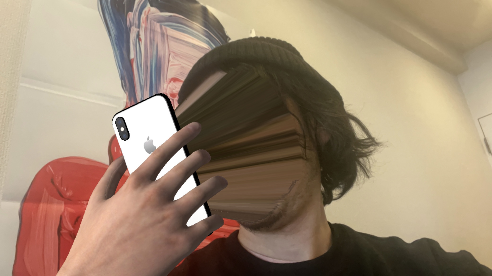

# kitasenju design profile

## text ver0

北千住デザインは、オンスクリーンにおける視覚表現の研究・開発を行っています。 主にプログラミングとリアルタイムレンダリング系のツールを用い、アルゴリズミックな表現はもちろんのこと、邪道的な道具の使い方や アイデアの組み合わせ（≒クソコラorヘタウマ）を用いて、 商業デザインの中では、こぼれ落ちてしまうような（しかし、魅力的な）視覚表現を 実験的に制作しています。そのアウトプット先として現在、 ウェブサイト・スマートフォンアプリ・VJ・ミュージックビデオ・モーションロゴ等の実績があります。

## text ver1

北千住に棲むプログラマー／アーティスト。Web、アプリ、VJなど、インタラクティブメディア上で、コードを用いて視覚表現の研究・開発をしている。21_21 DESIGN SIGHTで行われたAUDIO ARCHITECTURE展に作品を出展するなど、いろいろ活動中。
http://kitasenjudesign.com/

## text ver2

北千住デザインは、オンスクリーンにおける視覚表現の研究・開発を行っています。 主にプログラミングとリアルタイムレンダリング系のツールを用い、アルゴリズミックな表現はもちろんのこと、邪道的な道具の使い方やアイデアの組み合わせ（≒クソコラorヘタウマ）を用いて、
画一的あるいは技術偏重な表現に陥らない、稀有で新しい表現を作り出すことを目標にしています。

Kitasenju Design is engaged in research and development of on-screen visual expression.

We mainly use programming and real-time rendering tools, not only algorithmic expressions, but also eclectic use of tools and ideas, so that we do not fall into uniform or technology-oriented expressions. The goal is to create rare and new expressions.

## text ver2.1

北千住に棲むプログラマー／ARクリエーター。アプリ・Web・VJなど、インタラクティブメディアにおける視覚表現の研究開発を行っている。
近年では21_21 DESIGN SIGHTで行われたAUDIO ARCHITECTURE展への出展や、フィルタアプリMEISAIの開発など、ARを使った作品を多く手掛けている。
http://kitasenjudesign.com/

## text ver3

北千住デザイン

プログラマー／ARクリエーター。
21_21 DESIGN SIGHT “AUDIO ARCHITECTURE展” へのARアプリの出展、フィルタアプリMEISAIの開発など近年はARを中心に活動中。
https://kitasenjudesign.com/

## text ver4

プログラマー／北千住デザイン主催

近年はAR(拡張現実）の領域で活動中、iOSアプリのMEISAI、SuperSlitScanを開発。
展示では、2018年AUDIO ARCHITECTURE展や2021年MediaAmbitionTokyoへ出展。
山梨県富士川町出身。http://kitasenjudesign.gom/

## text ver4.1

北千住デザイン（渡邊敬之)
ARクリエーター／プログラマー
AR技術を映像製作のためのメディウムととらえていろんな実験を行なっている。
主な仕事に、ARフィルタアプリのMEISAIの開発、AUDIO ARCHITECTURE展やMediaAmbitionTokyoへ出展、雑誌「広告 Vol.416 特集：虚実」のアートワークなど。
http://kitasenjudesign.gom/

## text ver4.2

北千住デザイン　（渡邊敬之)
ARクリエーター／プログラマー
ARを使った主な仕事に、iOSアプリのMEISAIの開発、AUDIO ARCHITECTURE展やMediaAmbitionTokyoへの出展、雑誌「広告 Vol.416 特集：虚実」のアートワークなど。
http://kitasenjudesign.gom/

## photo

## 登壇

* 2015.12 [DemoDay.Tokyo](https://www.youtube.com/watch?v=eyGrbDR5uqk)
* 2016.10 DevFest2016 Tokyo / [資料](https://docs.google.com/presentation/d/1i9YYhNgjh1SH-xka3gpsCUG0zLz9njjzMuga3j6pobk/edit?usp=sharing)
* 2018.08 [AUDIO ARCHITECTURE展リレートーク](http://www.2121designsight.jp/program/audio_architecture/events.html)
* 2018.10 Unity x ARKit 入門Meetup
* 2019.02 [Polygon Lounge](https://github.com/PolygonLounge/PolygonLounge-1) / [資料](https://docs.google.com/presentation/d/1xxjXO9ay7tFBnDNa328HZXM5P5ifmdppKDBCVKLYSt8/edit?usp=sharing)
* 2019.05 NEORT MEETUP
* 2019.12 ARISE #2

## メディア

* 2016.03 雑誌 / [MDN 2016年3月号 人と人 「渡邊敬之 × 橋本麦」](https://books.mdn.co.jp/magazine/3215101003/)
* 2016.03 Web / [SENSORS](http://www.sensors.jp/post/demoday_3.html)
* 2018.08 Web / [HILLS LIFE](https://hillslife.jp/culture/2018/07/11/creative-process-4/)
* 2018.10 雑誌 / [ブレーン2018年10月号 今月のブックマーク寄稿](https://mag.sendenkaigi.com/brain/201810/bookmark/014298.php)
* 2019.02 ラジオ / [TOKYO SOUNDS GOOD ゲスト出演](https://twitter.com/TokyoSoundsGood/status/1101368964020486146)
* 2019.04 Web / [映像作家100選出](https://eizo100.jp/archives/category/2019/)
* 2019.08 Web / GIZMODE
* 2019.12 AppStore / App of the day

## 展示

* 2018.07 [21_21 DESIGN SIGHT / AUDIO ARCHITECTURE](http://2121designsight.jp/program/audio_architecture/)
* 2019.01 [SONY PARK / AAAR vol1](http://artscape.jp/exhibition/art-flash-news/2018/10151501_21045.html)
