# Selected Works - 2017

## トモテレ - 2017

* Client / テレビ東京
* Role / 実装(Unity)
* URL / --

テレビ東京のインタラクティブなテレビ番組。視聴者はスマホからアンケートに回答でき、その投票の経過や結果をビジュアライズした。Unityで実装。

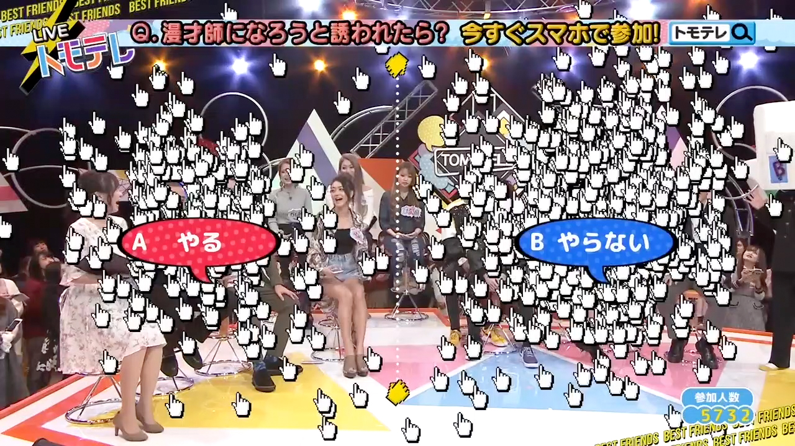
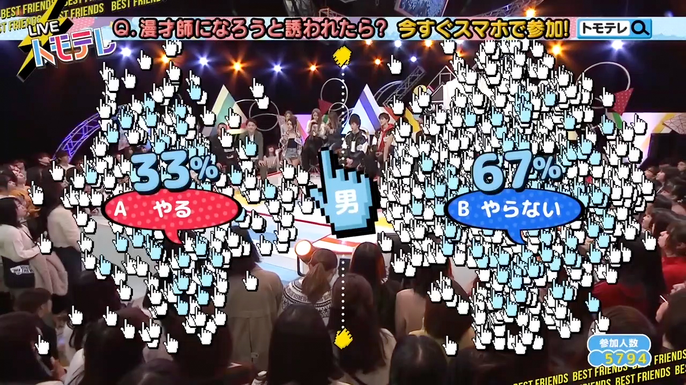

## TANABATARIUM - 2017

* Client / 日本テレビ
* Role / ディレクション、実装(Unity)
* URL / https://www.bascule.co.jp/work/tanabatarium2017/

七夕用４分半の映像インスタレーション。ユーザは事前に願いの入力と動画を撮影し、映像内に参加できる。Vコン製作から始まり、Unityでの実装までを担当。

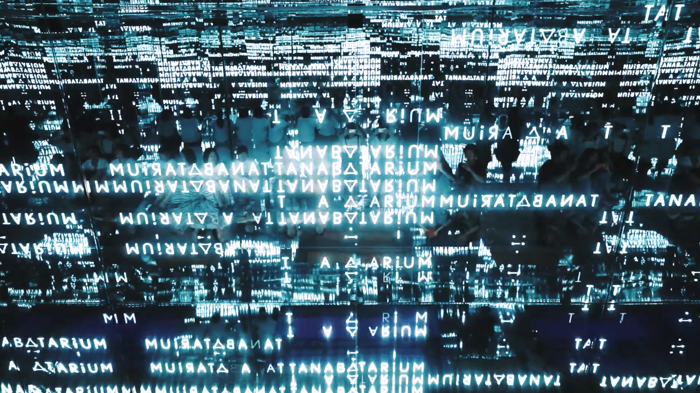

## KABUKI AVATAR - 2016

* Client / Panasonic
* Role / 実装(Cinema4D)
* URL / https://www.bascule.co.jp/work/kabuki-avatar/

ステージとカメラアングルを制作

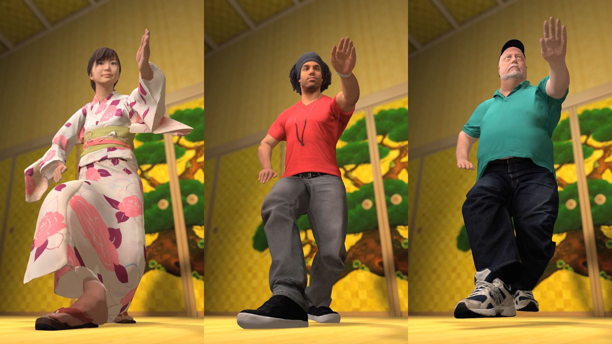
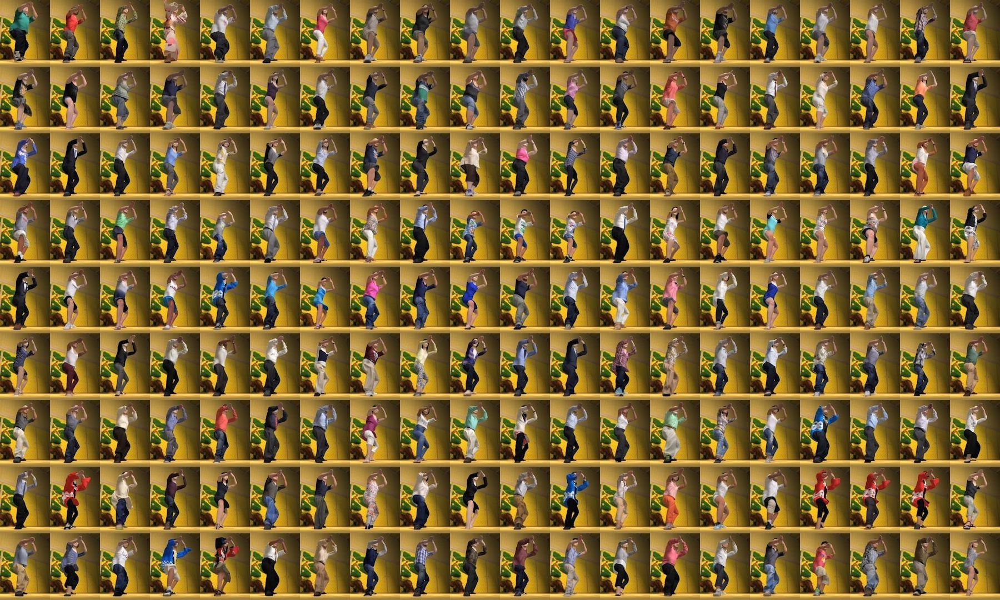

## Neymar Crazy Skills - 2015
* Client / Panasonic 
* Role / 演出, 実装(WebGL)
* URL / https://www.bascule.co.jp/work/neymar-jr-crazy-skills/

ネイマールの技モーションをWebGLで見られる企画。はじめてWebGLを本格的に使ってコンテンツ。PCの実装と、ネイマールが並んでるリストやカメラアングルなどの演出を考えた。

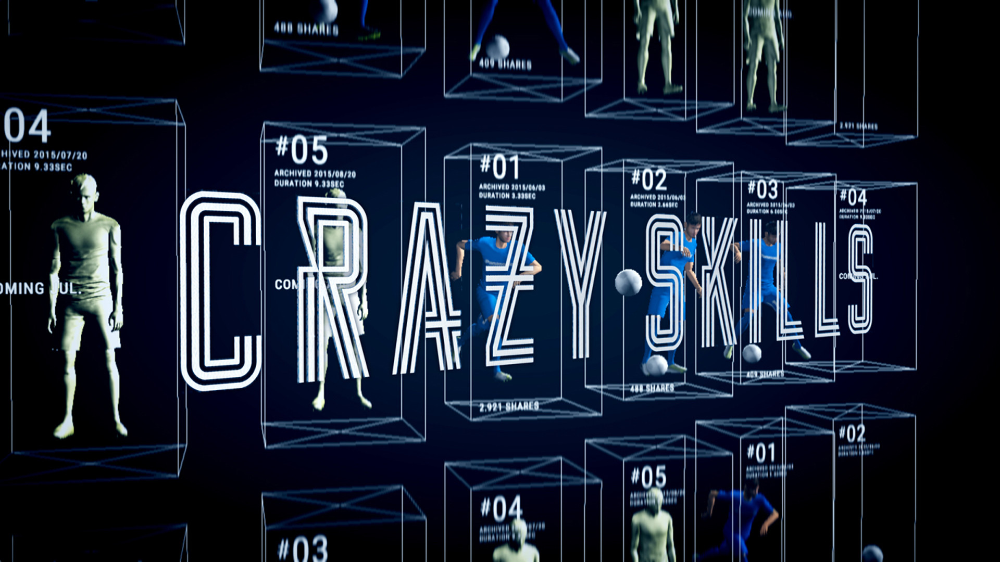
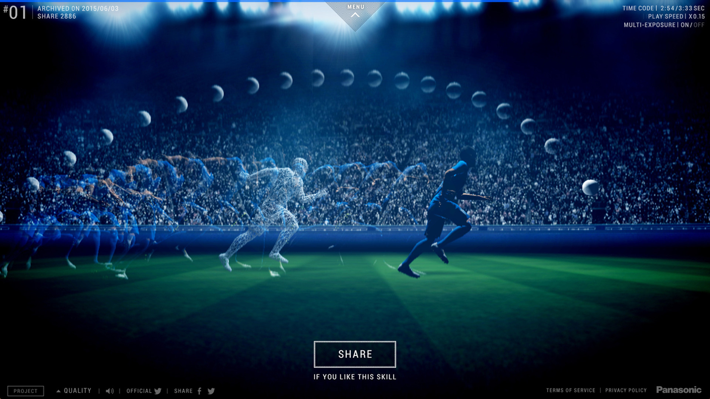

## TOKYO CITY SYMPHONY - 2014
* Client / 森ビル
* Role / 実装(Flash)
* URL / https://www.bascule.co.jp/work/tokyo-city-symphony/

森ビルの1/1000模型にプロジェクション映像を素材にしてユーザーが音楽を奏でられる企画。音と動画がずれないように、とか、現場で撮影したものをすぐに確認するようにできるようにするとか、プロトタイプの作成から実装を担当。

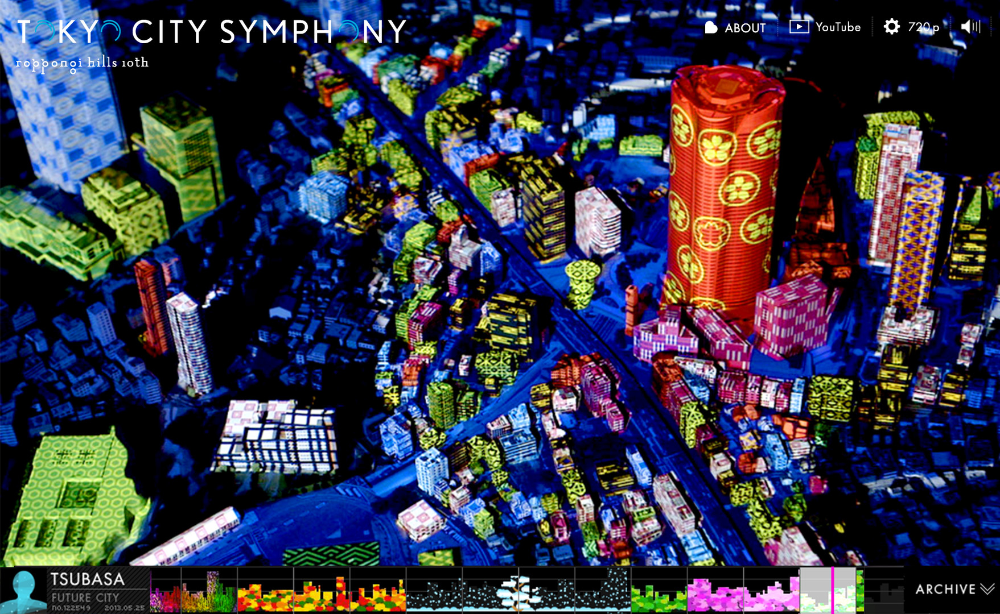
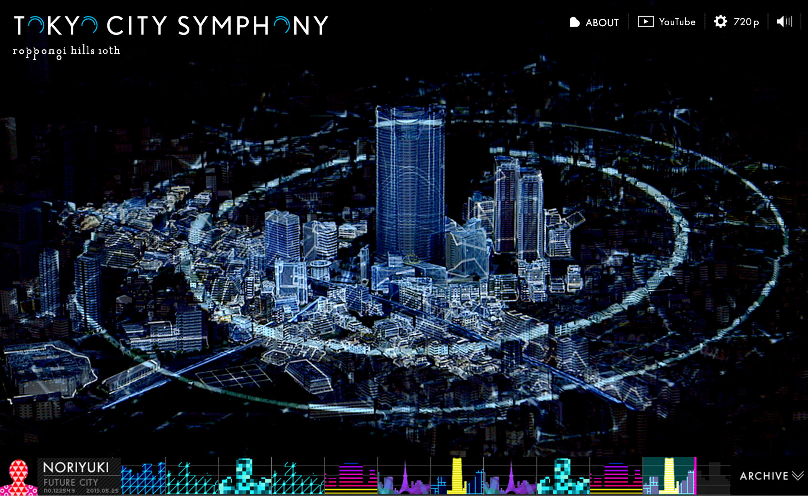

## Drive Go Round - 2015

360度カメラを使った映像コンテンツ。彼女とのドライブの記憶を追体験。

* Client / TOYOTA
* Role / 実装(Flash)
* URL / --

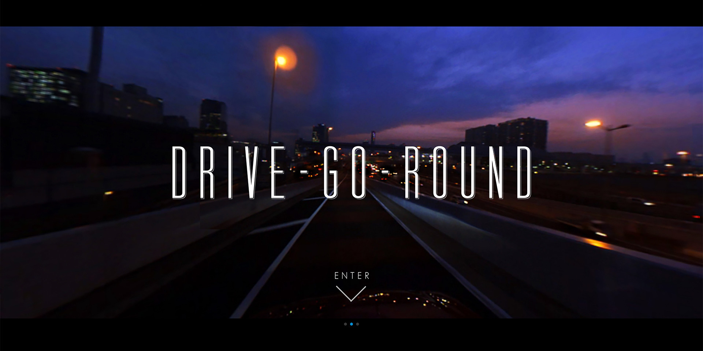
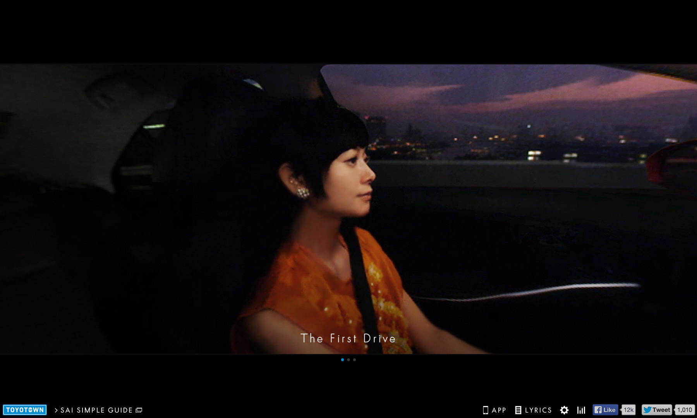

* Client / Mori Building
* Role 

## Haruhi Hunting - 2014

* Client / --
* Role / 実装(Flash)
* URL / --

日本全国に配置されたハルヒの映像の各フレームをユーザーに写真に撮ってもらいみんなで動画を作ろうとういう企画。この頃、構造を視覚化するとそれだけで面白いという発見があり、トップのムービーからインターフェイスが全体が、企画を体現しているようなインターフェイスにしている。

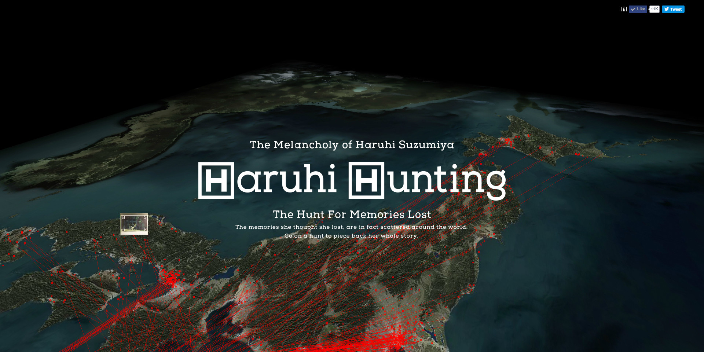
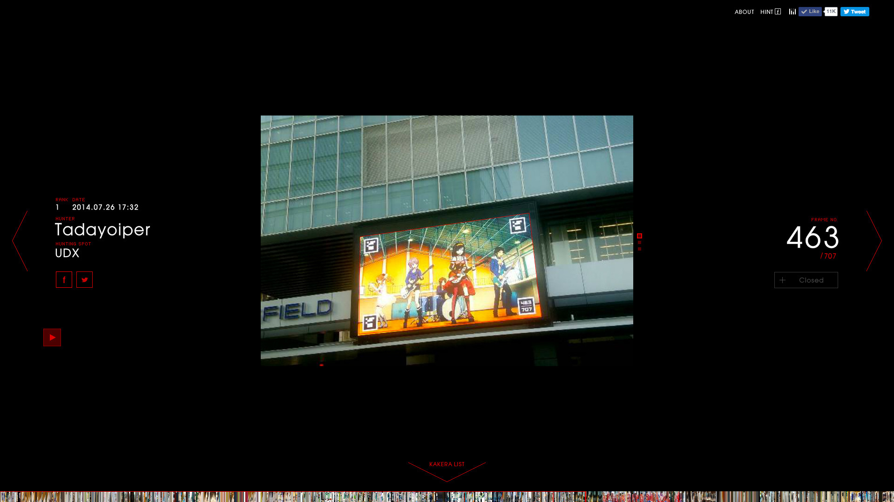
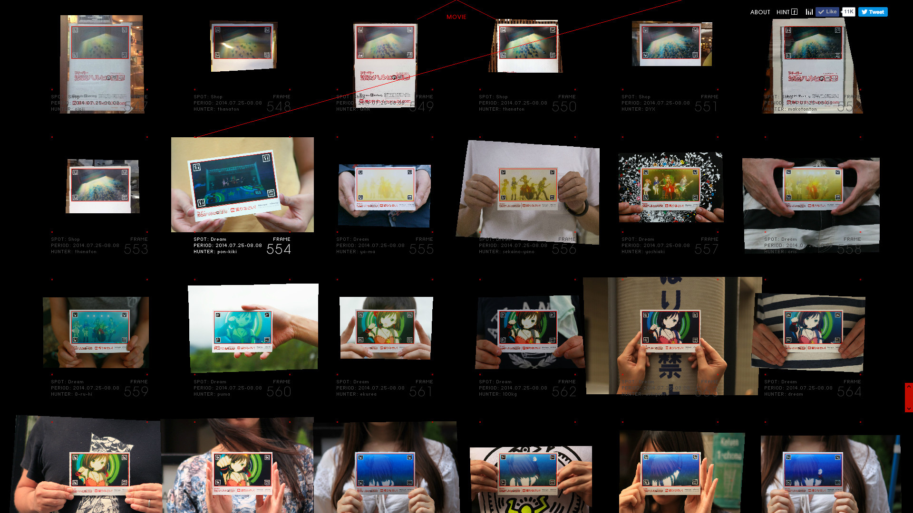

