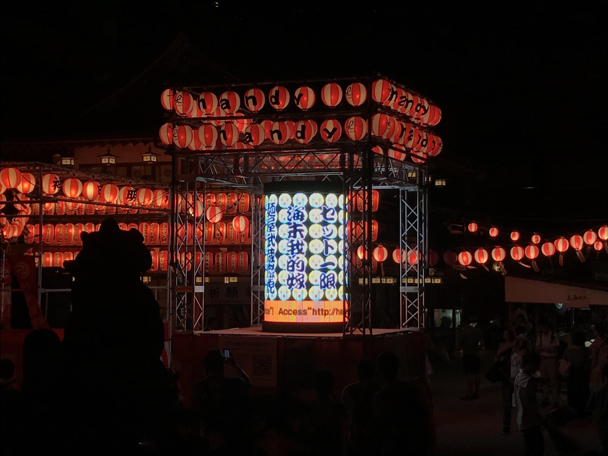

# Kitasenju Design Work 2018

## JIDO-RHYTHM

* Format / Smartphone App
* Client / --
* Role / 実装(Unity)
* URL / http://kitasenjudesign.com/jido-rhythm/

21_21 DESGIN SIGHTで行われた　Audio　Architecture展に出展したアプリ。
ミュージックビデオのフォーマットに自撮りを取りこんだ、インタラクティブなミュージックビデオ。

## Brain Drool 2018

* Format / Website
* Client / 博報堂
* Role / 実装(HTML,CSS,JS)
* URL / http://brain-drool.jp/2018/

## Handy.dance

* Format / Desktop App
* Client / Handy
* Role / 実装(Unity)
* URL / --

神田明神で行われた盆踊りの際に、巨大なLEDディスプレイを用意し、それを提灯に見立て、曲に合わせてVJを行なった。

## Generative Digital Signage

* Format / Desktop App
* Client / 未公表
* Role / 実装(Unity)
* URL / --

デジタルサイネージ用のトランジションエフェクトを制作。

## Mr.Children Tour 2018 MONSTER Live Effect

* Format / Desktop App
* Client / ENGINE
* Role / 実装(Unity)
* URL / --

Mr.Children2018ツアーのMONSTERという楽曲の演出用のライブエフェクト。

## MuDA

* Format / Website
* Client / MuDA
* Role / 演出、実装(WebGL)
* URL / --

スイス・チューリッヒにあるデジタルアートミュージアムのウェブサイト用のカバーページの演出。

## Magic Illumination

* Format / Desktop App
* Client / Google
* Role / 実装(Unity)
* URL / --

表参道で行われたイルミネーションの制御用のアプリケーションの演出、制作。

## AAAR

* Format / Smartphone App
* Client / DNP
* Role / 作品提供（実装・演出)

