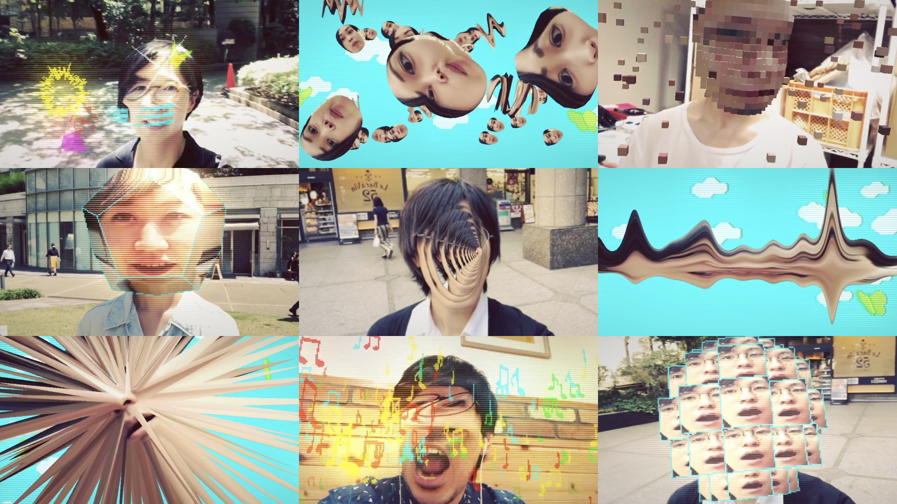
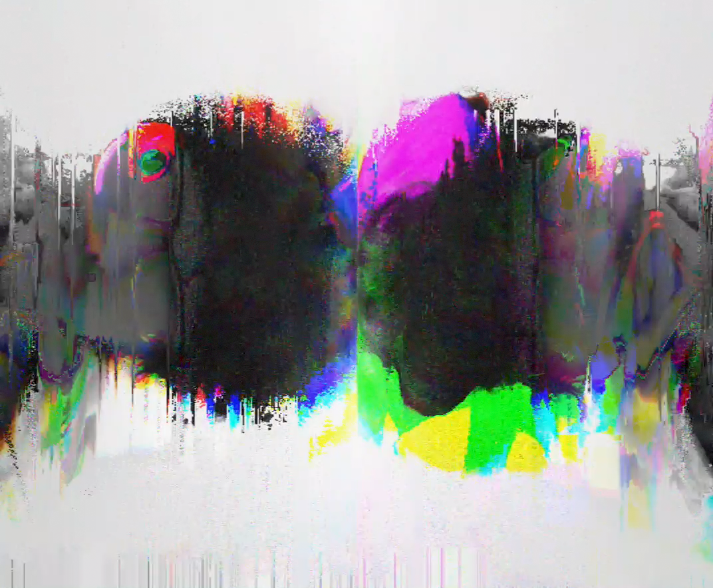
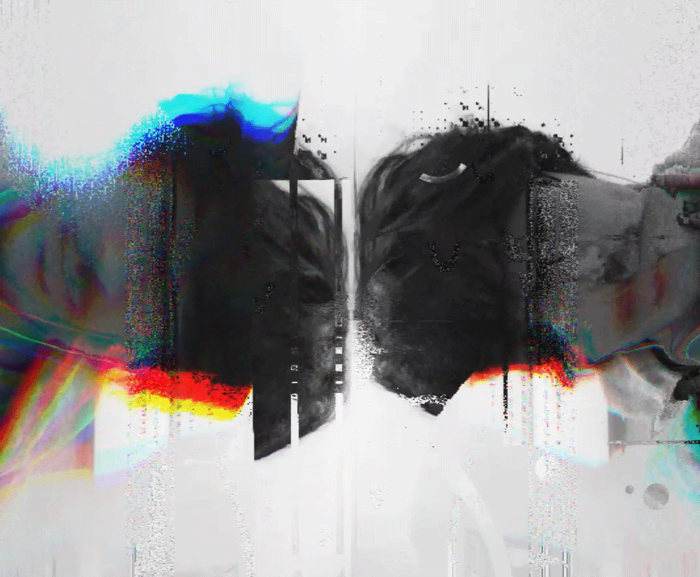
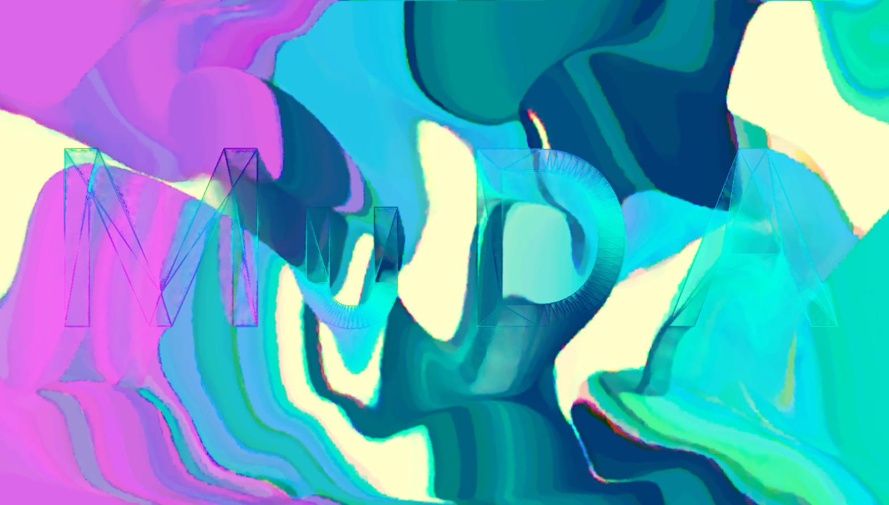
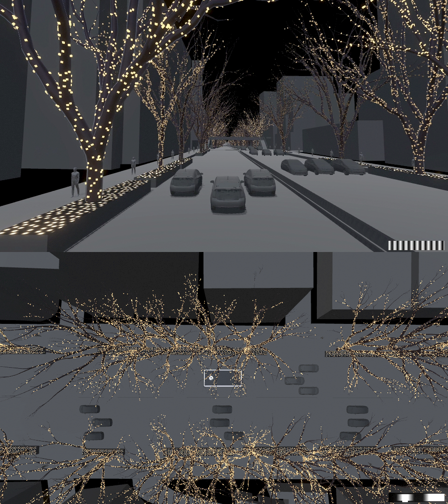
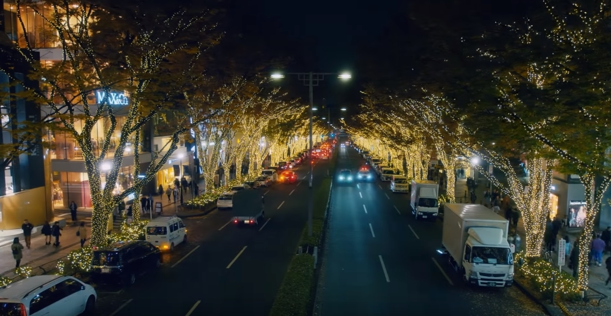

# Kitasenju Design 制作物 2018

## JIDO-RHYTHM

* Format / Smartphone App
* Client / --
* Role / 実装(Unity)
* URL / [http://kitasenjudesign.com/jido-rhythm/](http://kitasenjudesign.com/jido-rhythm/)

21_21 DESGIN SIGHTで行われた　Audio　Architecture展に出展したアプリ。
ミュージックビデオのフォーマットに自撮りを取りこんだ、インタラクティブなミュージックビデオ。
以前から作っていた顔変形エフェクトの集大成。

## Brain Drool 2018

* Format / Website
* Client / 博報堂
* Role / 実装(HTML,CSS,JS)
* URL / [http://brain-drool.jp/2018/](http://brain-drool.jp/2018/)

スパイラルで行われた脳よだれ展という写真展のウェブサイト。トップページでよだれを表現。

## Handy.dance

* Format / Desktop App
* Client / Handy
* Role / 実装(Unity)
* URL / https://www.bascule.co.jp/work/handy2018/

神田明神で行われた盆踊りの際に、巨大な円筒状の提灯風のLEDディスプレイを用意し、動的にユーザの名前を表示できるシステムを制作。あとVJ的な仕組みも。

## Generative Digital Signage

* Format / Desktop App
* Client / 未公表
* Role / 実装(Unity)
* URL / --

デジタルサイネージ用のトランジションエフェクトを２種類制作。ひとつは画像をピクセルに分解して別画像にモーフィング。もうひとつは物理シミュレーションでモザイク画をつくるというもの（画像はない）。

## Mr.Children Tour Live Effect

* Format / Desktop App
* Client / ENGINE
* Role / 実装(Unity)
* URL / --

Mr.Children2018ツアーのMONSTERという楽曲のライブエフェクトを制作しアプリとして提供。グリッチ的エフェクトをこねくりまわした。

## MuDA

* Format / Website
* Client / MuDA
* Role / 演出、実装(WebGL)
* URL / [http://kitasenjudesign.com/sketch/13/](http://kitasenjudesign.com/sketch/13/)

スイス・チューリッヒにあるデジタルアートミュージアムのウェブサイト用のカバーページの演出。フィードバックエフェクトの習作。暇な時間を見つけては、いじっていた習作がこんな形で日の目にあたりうれしい。そのうちちゃんと公開。

## Magic Illumination

* Format / Desktop App
* Client / Google
* Role / 実装(Unity)
* URL / [https://www.youtube.com/watch?v=k0Yp1PWHhuc](https://www.youtube.com/watch?v=k0Yp1PWHhuc)

表参道で行われたイルミネーションのシミュレーターとDMX制御用のアプリケーションの制作。

#### [INDEX](https://kitasenjudesign.github.io/work/)

