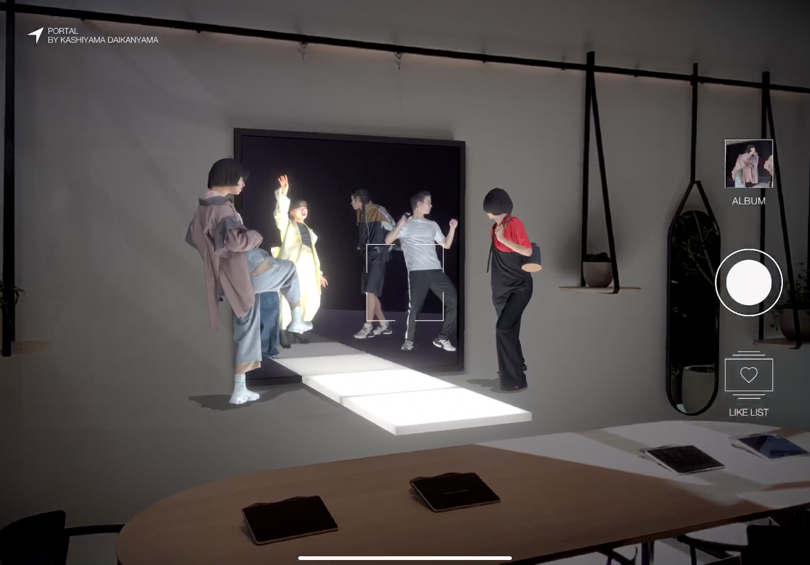
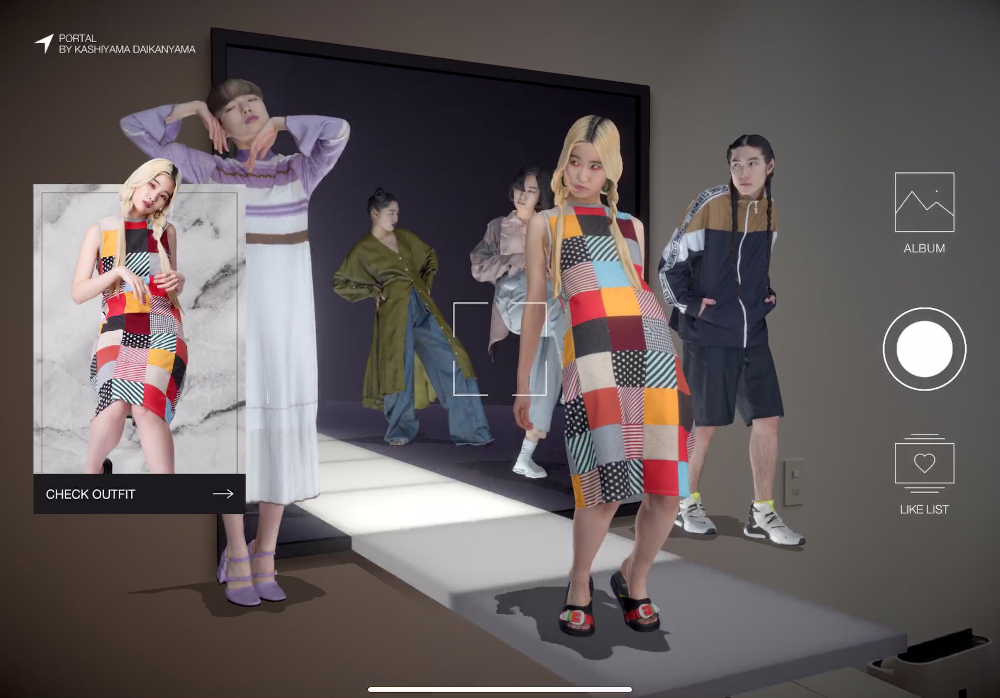
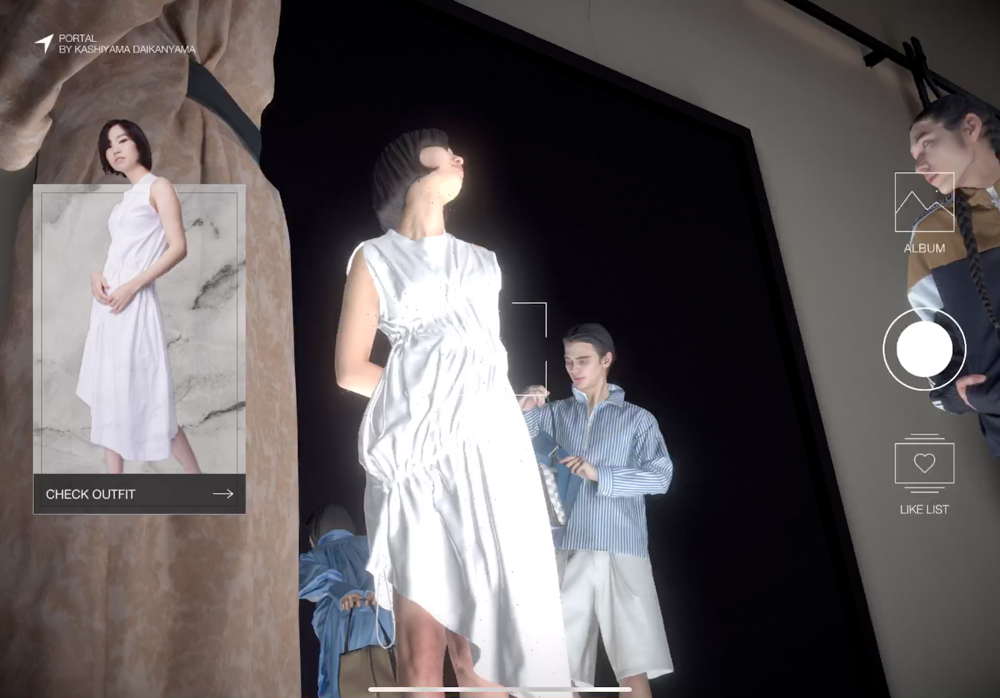
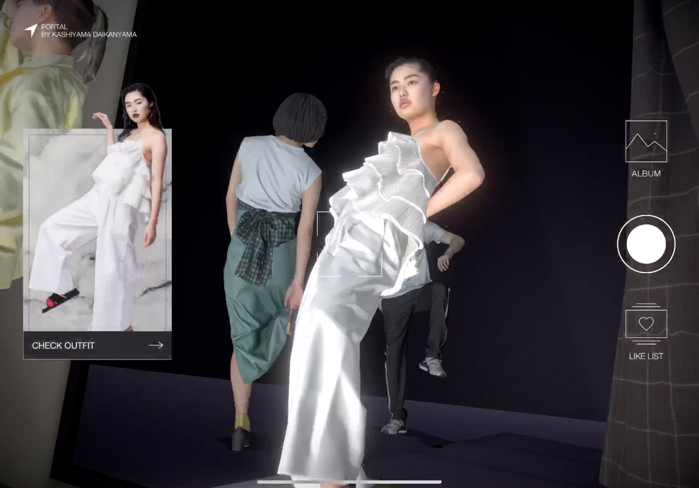
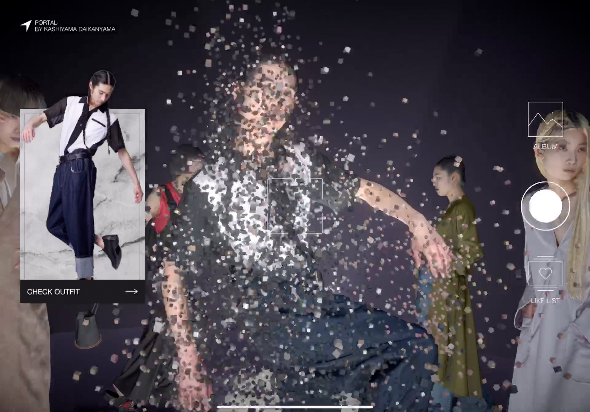

# Kitasenju Design Works 2019

## AAAR vol1

* Format / Smartphone App
* Client / DNP
* Role / 演出、実装(Unity)
* URL / [https://artscape.jp/ginza/](https://artscape.jp/ginza/)

ソニーパーク内で行われたAAAR展への作品提供。Instancingというテーマでいろいろ３つのモチーフをAR上で複製しまくるというもの。第１弾はソリティアネタ。第３弾まであり。

## PORTAL

* Format / Smartphone App
* Client / ---
* Role / 演出、実装(Unity)
* URL / [https://youtu.be/WpawuZ0PmwA](https://www.youtube.com/watch?v=WpawuZ0PmwA)

ARファッションショー。3Dスキャンされたモデルが100体登場。主に、演出部分のプロトタイプ制作と実装を担当。

## 078 AR City

* Format / Smartphone App
* Client / ---
* Role / 実装(Unity)
* URL / --

オープニング・エンディングの実装を担当。

## Asics 

* Format / Desktop App 
* Client / ---
* Role / 実装(Unity)
* URL / --

#### [INDEX](https://kitasenjudesign.github.io/work/)
