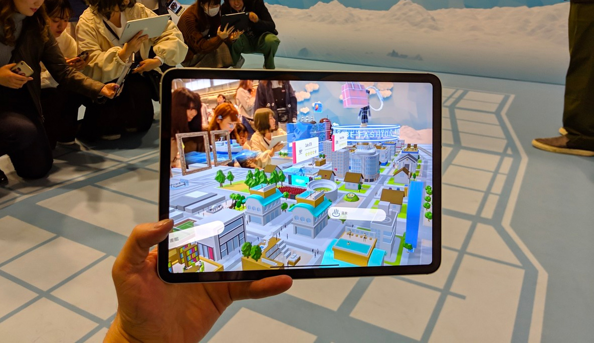

# Kitasenju Design Works 2019

## AAAR vol1

* Format / Smartphone App
* Client / DNP
* Role / 演出、実装(Unity)
* URL / [https://artscape.jp/ginza/](https://artscape.jp/ginza/)

ソニーパーク内で行われたAAAR展への作品提供。Instancingというテーマでいろいろ３つのモチーフをAR上で複製しまくるというもの。第１弾はソリティアネタ。第３弾まであり。

## PORTAL

* Format / Smartphone App
* Client / ---
* Role / 演出、実装(Unity)
* URL / [https://youtu.be/WpawuZ0PmwA](https://www.youtube.com/watch?v=WpawuZ0PmwA)

ARファッションショー。3Dスキャンされたモデルが100体登場。演出部分の実装を担当。

## 078 AR City

* Format / Smartphone App
* Client / MESON
* Role / 実装(Unity)
* URL / https://078kobe.jp/events/8817/

オープニング・エンディングの実装を担当。

## Asics Graphic Generator

* Format / Desktop App 
* Client / Asics
* Role / 実装(Unity)
* URL / --

「全部カラダなんだ」というアシックスのタグラインのもと、ポスター・ウェブ・映像に使用するグラフィック生成ツールを作りました。
スポーツ選手・歌手・ダンサーなどのモデルに合わせ、本人をモーションキャプチャーしたデータの手足をブラシに見立ててグラフィックを生成します。

## kao.dance

* Format / Desktop App 
* Client / ---
* Role / 実装(Unity)
* URL / --

神田明神で行われた盆踊りのLEDディスプレイで体験できる映像コンテンツです。

#### [INDEX](https://kitasenjudesign.github.io/work/)
